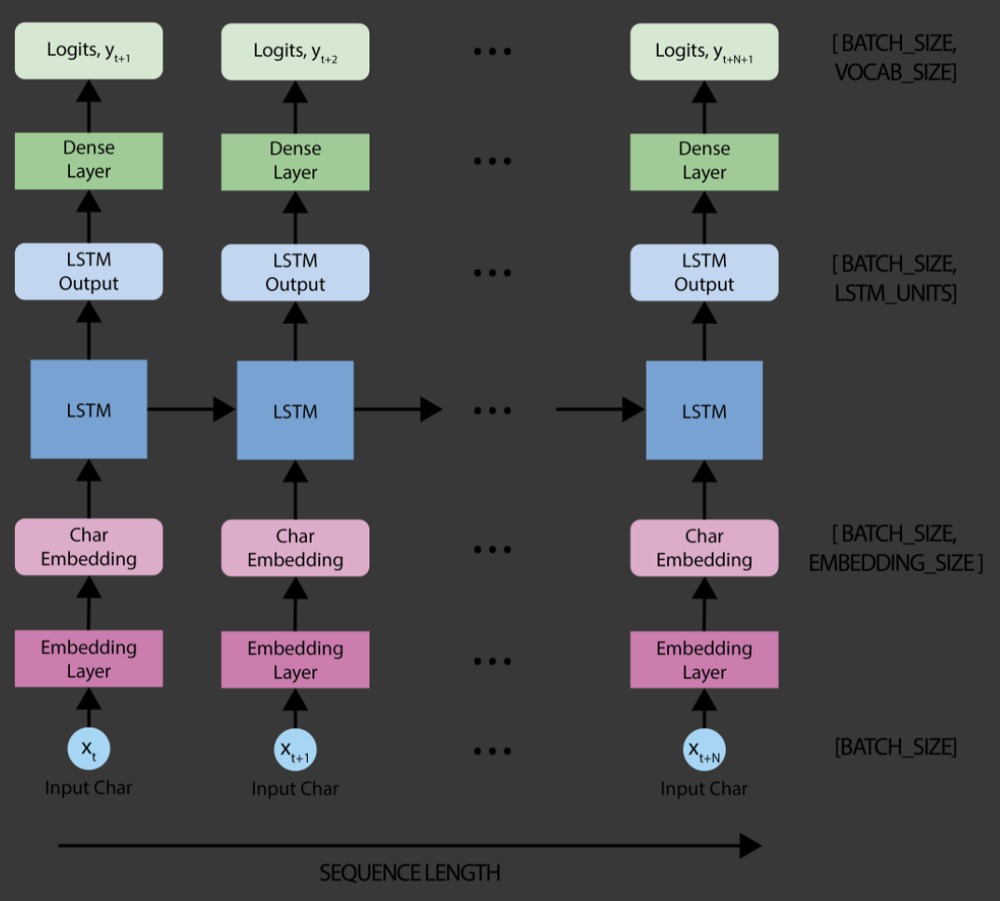

# Music Generation with RNNs

We will explore building a Recurrent Neural Network (RNN) for music generation. We will train a model to learn the patterns in raw sheet music in [ABC notation](https://en.wikipedia.org/wiki/ABC_notation) and then use this model to generate new music.

## Dataset

We will use a dataset of thousands of Irish folk songs, represented in the ABC notation.
We can easily convert a song in ABC notation to an audio waveform and play it back. Be patient for this conversion to run, it can take some time.

```python
from src.dataloader import DataLoader
dataloader = DataLoader(seq_len=100, batch_size=1, dataset_path="src/data")
songs = dataloader.load_training_data()
example_song = songs[0]
print(example_song)
```

```
X:1
T:Alexander's
Z: id:dc-hornpipe-1
M:C|
L:1/8
K:D Major
(3ABc|dAFA DFAd|fdcd FAdf|gfge fefd|(3efe (3dcB A2 (3ABc|!
dAFA DFAd|fdcd FAdf|gfge fefd|(3efe dc d2:|!
AG|FAdA FAdA|GBdB GBdB|Acec Acec|dfaf gecA|!
FAdA FAdA|GBdB GBdB|Aceg fefd|(3efe dc d2:|!

```

```python
dataloader.play_song()
```


## Data Preprocessing

##### Vectorizing the text

We will convert the text for the songs into a numerical representation before we start to train our model. For that, we 
will use two lookup tables: one to map characters to numbers & a second one to map numbers back to characters.

```python
char2idx = {u:i for i, u in enumerate(vocab)}
idx2char = np.array(vocab)
```

Example char2idx:

```
{
  '\n':   0,
  ' ' :   1,
  '!' :   2,
  '"' :   3,
  '#' :   4,
  "'" :   5,
  '(' :   6,
  ')' :   7,
  ',' :   8,
  '-' :   9,
  '.' :  10,
  '/' :  11,
  '0' :  12,
  '1' :  13,
  '2' :  14,
  '3' :  15,
  '4' :  16,
  '5' :  17,
  '6' :  18,
  '7' :  19,
  ...
}
```

#### Creating training examples & targets

We will divide the text into example sequences for training. Each input sequence that we feed 
to the RNN, will contain a `seq_len` characters from the text. We also define the target sequence
for each input sequence, which will be used to train the model to predict the next character. For each input, 
the corresponding target will contain the same length of text, except shifted by one character to the right.

## Model Architecture

```
_________________________________________________________________
Layer (type)                 Output Shape              Param #   
=================================================================
embedding_1 (Embedding)      (32, None, 256)           21248     
_________________________________________________________________
lstm_1 (LSTM)                (32, None, 1024)          5246976   
_________________________________________________________________
dense_1 (Dense)              (32, None, 83)            85075     
=================================================================
Total params: 5,353,299
Trainable params: 5,353,299
Non-trainable params: 0
_________________________________________________________________
```



## Training the model

To train our model on this classification task, we can use a form of the crossentropy loss (negative log likelihood loss).
Specifically, we will use the sparse_categorical_crossentropy loss, as it utilizes integer targets for categorical 
classification tasks. We will want to compute the loss using the true targets -- the labels -- 
and the predicted targets -- the logits.

##### Hyperparameters
```
num_training_iterations
batch_size = 32  # Experiment between 1 and 64
seq_length = 100  # Experiment between 50 and 500
learning_rate = 5e-3  # Experiment between 1e-5 and 1e-1
```
##### Model parameters:
```
vocab_size = len(vocab)
embedding_dim = 256 
rnn_units = 1024 
```


## Prediction

When generating music, we'll have to feed the model some sort of seed to get it started 
(because it can't predict anything without something to start with!).

The prediction process:

* Initialize a "seed" start string and the RNN state, and set the number of characters we want to generate.

* Use the start string and the RNN state to obtain the probability distribution over the next predicted character.

* Sample from multinomial distribution to calculate the index of the predicted character. This predicted character is then used as the next input to the model.

* At each time step, the updated RNN state is fed back into the model, so that it now has more context in making the next prediction. After predicting the next character, the updated RNN states are again fed back into the model, which is how it learns sequence dependencies in the data, as it gets more information from the previous predictions.


### Credits

* This was an exercise from - [http://introtodeeplearning.com/](http://introtodeeplearning.com/)
* Jupyter Notebook for exercise - [lab1/Part2_Music_Generation.ipynb](https://github.com/aamini/introtodeeplearning/blob/master/lab1/Part2_Music_Generation.ipynb)